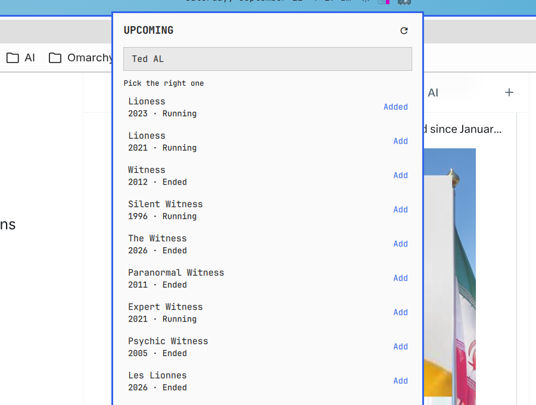

# Upcoming for Omarchy

A small Omarchy bar widget for the shows you actually watch. Search [TVmaze](https://www.tvmaze.com/api)
to pick the right title (year and network shown so Silo on Apple TV is not Silo on meWATCH), then
see when the next episode is due.

No API key. The list lives in `~/.local/state/omarchy-upcoming/watchlist.json` (mode 0600), not in `shell.json`.



## What it does

- **Bar chip** — the soonest upcoming episode among your list, e.g. `Silo · S4E1 Jul 9 2027`. Empty until you add a show.
- **Click the chip** — search, pick a match, remove shows, refresh air dates.
- **Middle-click the chip** — refresh without opening the panel.

TVmaze tracks listed air dates, not “released on my service in my country”. Ended shows and titles with no date yet still sit on the list as ended / TBA.

## Requirements

- Omarchy (Quickshell bar), 4.0.3 or later.
- Python 3 (stdlib `urllib` only).
- Network access to `https://api.tvmaze.com`.

## Install

```sh
omarchy plugin add https://github.com/ninepointlabs/omarchy-upcoming.git --enable
```

That clones into `~/.config/omarchy/plugins/ninepointlabs.upcoming` and turns it on. To update later:

```sh
omarchy plugin update ninepointlabs.upcoming
```

### From a local checkout

```sh
~/Projects/omarchy-upcoming/install.sh
omarchy plugin enable ninepointlabs.upcoming
omarchy restart shell
```

`install.sh` copies into the plugin directory and validates. It does not enable the widget or restart the shell.

## Remove

```sh
omarchy plugin remove ninepointlabs.upcoming
```

Your watchlist in `~/.local/state/omarchy-upcoming/` is left in place.

## Limits

- Twenty-four shows.
- Refresh is polite: on add, on load, on demand, and every six hours.
- Some streaming calendars land late or as TBA. That is TVmaze, not a bug in the chip.

## Security notes

- No API key, no credentials, nothing in `shell.json` or process argv besides the helper path.
- Search queries and show ids go to `bin/upcoming-ops` over stdin. TVmaze responses are capped producer-side (`scripts/bounded-job-wrapper.sh`, 256 KiB / 64 KiB).
- HTTPS calls are only to `api.tvmaze.com`; redirects off that host are refused.
- The watchlist is written via `mktemp` + `chmod 600` + `mv -f` in the same directory, so a planted symlink is replaced rather than followed.
- Show names and episode titles are stripped of tags in the parser and rendered as `Text.PlainText`.
